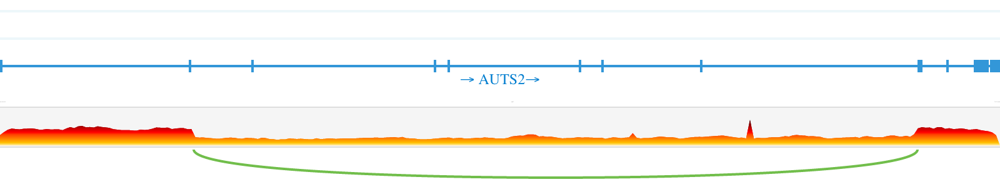

# WTC-11
## Tychele N. Turner, Ph.D.
## Readme Update: February 16, 2024

This repository holds information regarding our assessment of whole-genome sequencing data on WTC-11. We are adding this repository since we have been asked a few times about our copy number variant assessment of the cell line data.

### Original Data Source
The data for this cell line comes from the Allen Institute for Cell Science. The genomics data is available at [https://www.allencell.org/genomics.html](https://www.allencell.org/genomics.html).

### Deletion in *AUTS2*
We noticed there was a deletion in *AUTS2* when looking at the genome sequence data. Since we have been asked several times about the event, we outline the evidence supporting it here in this GitHub.

#### Evidence from the 10x Linked whole-genome sequencing (WGS) Data
The 10x linked read whole-genome sequence data is available at Allen Cell at this link: [https://open.quiltdata.com/b/allencell/tree/aics/wtc11_linkedread_wgs/](https://open.quiltdata.com/b/allencell/tree/aics/wtc11_linkedread_wgs/). We downloaded the loupe file in the supporting_files folder and visualized it in the 10x Genomics loupe browser. Below is a png of the deletion event inside the *AUTS2* gene:

#### Evidence from the short-read WGS Data
We used the WTC-11 short-read WGS data for development of our tool called PYRUS (see also [https://github.com/TNTurnerLab/PYRUS](https://github.com/TNTurnerLab/PYRUS)).

